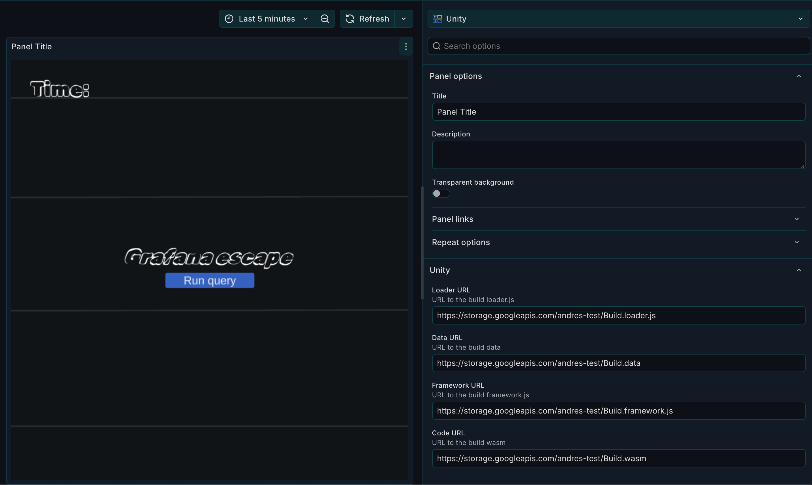

# Unity panel for Grafana

This plugin is a panel plugin for playing Unity games in Grafana.

It is a simplified version of https://github.com/ertis-research/grafana-panel-unity.

It uses [React Unity WebGL](https://react-unity-webgl.dev/) to embed Unity WebGL builds in a Grafana panel.

## Getting started

### Frontend

1. Install dependencies

   ```bash
   npm install
   ```

2. Build plugin in development mode and run in watch mode

   ```bash
   npm run dev
   ```

3. Build plugin in production mode

   ```bash
   npm run build
   ```

Then make the plugin available in your Grafana instance.

# Adapting games to be played in Grafana

Check the [Unity build requirements](https://github.com/ertis-research/grafana-panel-unity/tree/main?tab=readme-ov-file#unity-build-requirements) for how to build your game for Grafana. In a nutshell, you need to:

- Generate a WebGL build of your game.
- Disable compression.
- Add the following code snippet to your game controller script (as explained in the [React Unity WebGL docs](https://react-unity-webgl.dev/docs/api/tab-index)):

```cs
using UnityEngine;

public class Example : MonoBehaviour {
  void Awake () {
#if UNITY_WEBGL == true && UNITY_EDITOR == false
    WebGLInput.captureAllKeyboardInput = false;
#endif
  }
}
```

# Adding a new game panel

When adding a new game panel, you need to a link to the different files that the WebGL build needs to be able to run.

- Loader URL
- Data URL
- Framework URL
- Code URL (WASM)


